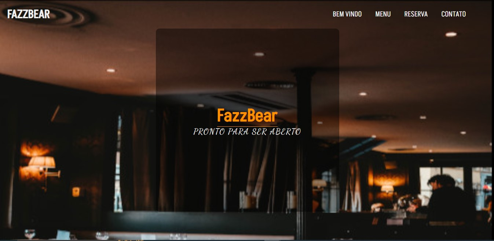
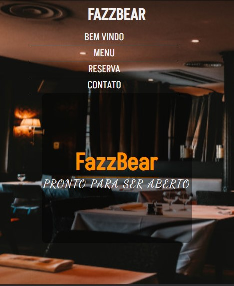

<h1>Website de apresentação para uma pizaria</h1>
<h2>Tecnologias usadas</h2>
<ul>
    <li>HTML</li>
    <li>CSS</li>
    <li>FLEXBOX</li>
</ul>
<h2>Acesso e sobre o projeto</h2>

Sendo feio por flexBox no estilo se torna fácil mover os elementos para manutenção e ainda com layout mais responsivo  quando a tela for menor.

    <h2>desktop</h2>
    

    <h2>mobile</h2>
    

<h2>Acesse pelo link: https://angelo-spyder.github.io/FazzBear-Pizzaria/</h2>